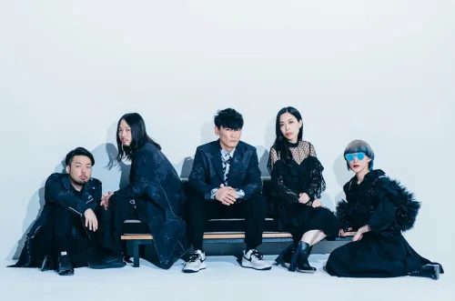

# Sakanaction

전세계 대 히트곡 보물섬을 유튜브에서 우연히 보고 알게 된 밴드. 2005년 홋카이도 삿포로에서 결성된 5인조로, "魚(사카나)" + "action"이라는 이름답게 록이랑 일렉트로닉을 뒤섞는다. 시적인 가사와 뽕짝스러운 리듬에 평소에도 하드코어 하이테크 고속도로 뽕짝 리믹스를 즐겨듣는 난 곧바로 광팬이 되어버리고 말았다.

4つ打ち 킥에 8비트 하이햇을 얹은 댄스 뮤직 구조를 밴드가 통째로 연주해버리는 게 이 밴드의 핵심이다. 베이스 라인이 루트 중심의 8비트 기본 패턴을 바탕으로 16비트 필 프레이즈가 중간중간 등장하는데 굉장히 듣기 편하다. 과하게 튀지 않고 잘 어울리며 깔아주는 역할을 충실히 하는데 홀릴 정도로 마음에 들었다. 보컬 야마구치 이치로의 가사는 하이쿠랑 시 문학의 영향을 받아 추상적 감정과 구체적 풍경이 오가는데, "가사가 어려우면 편곡은 쉽게, 가사가 쉬우면 편곡은 복잡하게"라는 원칙이 곡을 듣다 보면 느껴진다.

## 내 추천 픽

- [セントレイ](https://www.youtube.com/watch?v=dTRLVB8UHt4)
- [Ame (A)](https://www.youtube.com/watch?v=Z4sP2XWnJf4)
- [アルクアラウンド](https://www.youtube.com/watch?v=vS6wzjpCvec)
- [ミュージック](https://www.youtube.com/watch?v=iVstp5Ozw2o)
- [夜の踊り子](https://www.youtube.com/watch?v=6AozElbRnTM)
- [Aoi](https://www.youtube.com/watch?v=65Ah1Yj59zA)
- [ボイル](https://www.youtube.com/watch?v=byRfJ8p4c6c)
- [スローモーション](https://www.youtube.com/watch?v=_aqs6HrGroM)
- [ショック！](https://www.youtube.com/watch?v=rEw1AVeuSjg)
- [プラトー](https://www.youtube.com/watch?v=cnR2YuaEl0c)
- [フクロウ](https://www.youtube.com/watch?v=qGEX1xX0GpE)
- [GO TO THE FUTURE](https://www.youtube.com/watch?v=8N77x9P_lFk)
- [ナイトフィッシングイズグッド](https://www.youtube.com/watch?v=6SoH6n044JE)
- [ネイティブダンサー](https://www.youtube.com/watch?v=t1NoXF2WO64)
- [アイデンティティ](https://www.youtube.com/watch?v=NN1k0Uk_It0)
- [モノクロトウキョー](https://www.youtube.com/watch?v=ZmhUhbTQ6TA)
- [さよならはエモーション](https://www.youtube.com/watch?v=sp02G7SPPEY)
- [新宝島](https://www.youtube.com/watch?v=HXvFZARF4n4)
- [忘れられないの](https://www.youtube.com/watch?v=HbXaUmWaU5Q)
- [陽炎](https://www.youtube.com/watch?v=PTHfF-JzmQk)
- [多分、風。](https://www.youtube.com/watch?v=3FknHmfP4GM)
- [モス](https://www.youtube.com/watch?v=-ydPxD2JxOE)
- [キャラバン](https://www.youtube.com/watch?v=fi-pxSQ90y8)
- [怪獣](https://www.youtube.com/watch?v=ukYEgbe2QPw)
- [ホーリーダンス](https://www.youtube.com/watch?v=U3yWfls_ASc)
- [いらない](https://www.youtube.com/watch?v=iRb67zfMF7M)