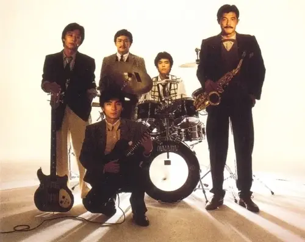

# T-Square

유튜브에서 [이 영상](https://www.youtube.com/watch?v=xKFALo7AIUo&list=RDxKFALo7AIUo)을 우연히 보고 알게 된 밴드

1976년 메이지 대학에서 기타리스트 안도 마사히로(安藤正容)를 중심으로 결성된 재즈 퓨전 밴드. 초기 이름은 THE SQUARE. 베이시스트 나카무라 유지, 피아니스트 하카마즈카 준, 드러머 하라다 슌이치로 출발했고, 1977년에 색소포니스트 이토 타케시(伊東たけし)가 합류.

Casiopea, Prism, Naniwa Express 등과 함께 일본 재즈 퓨전(J-Fusion)의 전성기를 이끌었다. 매년 1장 이상 앨범을 발표하는 왕성한 활동을 지속했고, 키보디스트 이즈미 히로타카(和泉宏隆)가 합류하면서 밴드의 작곡 역량이 크게 확장되었다.

슬프게도, 밴드가 창설된 후로 많은 시간이 흐른만큼 창립 멤버 중에 사망한 인물도 있다.

[블루 자이언트](https://www.youtube.com/watch?v=UDfwxhbK7wo)를 보고 난 다음에 알게 된 밴드인지라, 색소폰이 더욱 인상적으로 귀에 때려박혀서 좋았다. 밝고 경쾌하며 드라이브 감이 있는 리듬이 특징이다.

## 내 추천 픽

- [Truth](https://www.youtube.com/watch?v=cIRh9UTA70Q&list=RDcIRh9UTA70Q)
- [Explorer](https://www.youtube.com/watch?v=KDVKaE_yg0U&list=RDKDVKaE_yg0U)
- [Sunnyside Cruise](https://www.youtube.com/watch?v=8895B5KA1x4&list=RD8895B5KA1x4)
- [Takarajima](https://www.youtube.com/watch?v=MgpEncVBnCw&list=RDMgpEncVBnCw)
- [Omens Of Love](https://www.youtube.com/watch?v=ifmFkKRhc8E&list=RDifmFkKRhc8E)
- [Cry For The Moon](https://www.youtube.com/watch?v=iPTOYpbgU3M&list=RDiPTOYpbgU3M)
- [Cape Light](https://www.youtube.com/watch?v=zVuDAcnqG3Y)

