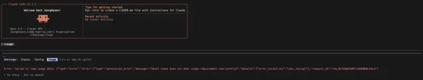

# Claude Code에서 /usage가 안보일때 조치 방법



한번이라도 CLAUDE_CODE_OAUTH_TOKEN 방식으로 로그인을 한 경우,
원래 구독 계정으로 돌아왔을때 /usage가 안보이는 문제가 발생한다.

환경변수를 지웠음에도 여전히 에러가 발생하길래, 아래 명령어를 .zshrc에 추가하여 해결했다.

```bash
unset ANTHROPIC_BASE_URL
unset ANTHROPIC_AUTH_TOKEN
unset CLAUDE_CODE_OAUTH_TOKEN
```

https://github.com/anthropics/claude-code/issues/13724
https://github.com/anthropics/claude-code/issues/11985
