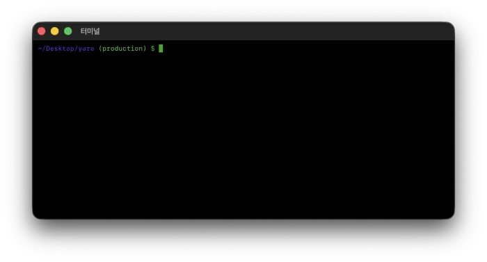

# 맥 터미널에 브랜치명 보이게 하기

.zshrc에 이걸 입력하면

```bash
autoload -Uz vcs_info
precmd() {vcs_info}
zstyle ':vcs_info:git:*' formats '(%b)'
setopt PROMPT_SUBST

PROMPT='%F{blue}%~%k%f %F{green}${vcs_info_msg_0_}%f $ '
```

이렇게 된다


