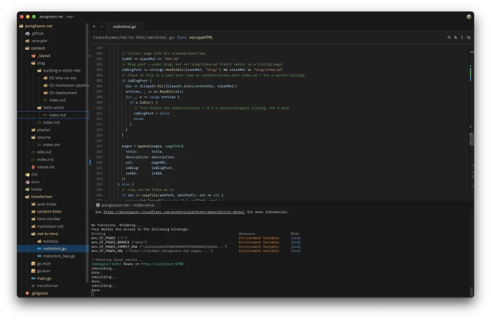

# Hello, World !

이 사이트는 CSS도 JavaScript도 없다. HTML만 있다. !!

왜 이렇게 만들었는가. 웹은 원래 문서였다. 링크로 연결된 텍스트. 거기에 스타일이 붙고, 동적 기능이 붙고, 빌드 파이프라인이 붙었다. 어느 순간 글 하나 올리려면 node_modules가 800MB가 된다.

여기서는 마크다운을 쓰면 HTML이 된다. 그게 전부다.

## 구조

글은 마크다운으로 작성한다. frontmatter 같은 건 없다. 제목은 H1에서 추출되고, 설명은 첫 문단에서 자동으로 가져간다. 폴더 구조가 곧 URL이 된다.

```
content/posts/hello-world/index.md → /posts/hello-world/
```

시리즈를 쓰고 싶으면 폴더 안에 번호 붙은 하위 폴더를 만든다. 그러면 자동으로 순서 목록이 생긴다.

## 기술 스택

Go로 만든 변환기가 마크다운을 HTML로 바꾼다. goldmark으로 parsing하고, tdewolff/minify로 최소화한다. GitHub Actions가 push마다 Cloudflare Pages에 배포한다.

복잡한 건 없다. 그게 핵심이다.


