# 내 첫차, 쉐보레 더 뉴 스파크

나이 5살 무렵부터 제 꿈 중 하나는 차를 소유하고 모는 것이었습니다. 학창시절때는 차종과는 상관없이 운전하는 모든 사람들이 너무나도 멋있어보였고 부러웠습니다. 대중교통과 도보로 힘겹게 이동하는 것과 대비되게 물건들을 잔뜩 실은채 목적지로 빠르게 향할 수 있는 차를 소유한다는 것은 마치 권력 같아보였달까요. 다비치의 노래 "사랑과 전쟁"을 튼채 창문을 다 내리고 광안대교를 건너는 아버지의 뉴 EF 소나타 수동차 조수석에 탔던 기억이 뇌리에 강렬하게 각인이 되어있습니다. 어릴땐 아버지의 양 어깨가 얼마나 한 없이 높아보였는지 모릅니다.

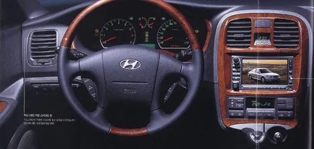

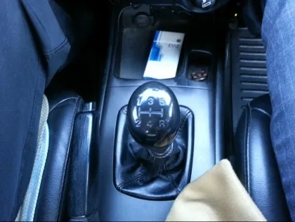

정말 오래 탔었는데 ㅎㅎ 제가 직접 몰진 않았지만 유년기와 학창시절을 함께 한 차라 사진만 봐도 그리움이 몰려오네요. 아버지가 운전의 달인이셔서 폼과 짜세가 남달랐습니다. 이 시절 차에는 후방 카메라가 당연하다 싶이 없었어서 빽도할때 조수석 헤드레스트에 손을 올린채 뒤를 바라보며 빠르게 후진하는건 매번 스릴 만점이었고 시속 170km 까지 달린 날엔 다리가 후덜거리고 욱신거려 잠도 설쳤었습니다.

중학생 시절 제주도로 가족여행을 가서 오토 차량을 렌트한 적이 있었는데 차를 몰기 시작하자마자 아버지가 이런 말씀을 하시더라구요.

"이건 차가 아니다, 너무 쉽다 범퍼카 같다"

시간은 흐르고 전 만 나이 22세에 2023년 8월 6일 사당 운전면허학원에서 2종 자동 면허를 취득했습니다. 수중에 차를 살 수 있을 정도로 돈이 모인 상황이니, 한시라도 빨리 운전을 하고 싶어서 모든 시험을 한방에 통과할 수 있는 난이도인 2종 자동을 취득해야겠다고 다짐하고 직장 동료 한명을 꼬셔 함께 응시했었습니다.

면허도 땄겠다, 차를 사려고 알아보니 고려해야할게 너무 많았습니다.

1. 신차일수록, 사고가 안나는 차종일수록, 안전장치가 많이 장착된 차일수록 보험료가 저렴하다.
2. 나이가 어릴수록 보험료는 기하급수적으로 비싸진다.
3. 키로수가 낮거나 생산연도가 최신일수록 신품가에 매우 가까워진다.
4. 하이패스 비용, 공영주차장 비용 할인 안받으면 상당히 비싸다.

직장 동료가 알려준 케이카 앱으로 매일매일 매물을 찾기 시작했고 끝내 저렴한 모닝 2인승 밴을 사게 되었으나. 차가 많이 녹슬고 침수차처럼 흙과 모래가 자꾸 발견되길래 원주까지 직접 운전하고 반품했습니다. 싼게 비지떡이라는걸 몸소 체득하게 되고, 비싸도 좋으니 상태 좋은 차를 사자는 생각에 카플레이도 지원하고 프레임도 튼튼하고 변속 충격도 없는 CVT 미션인 쉐보레 스파크를 사게 되었습니다.

"차는 용기로 사는겁니다"

비싼 가격에 망설이던 저를 한번에 설득한 동료의 외침 덕분인걸까요.

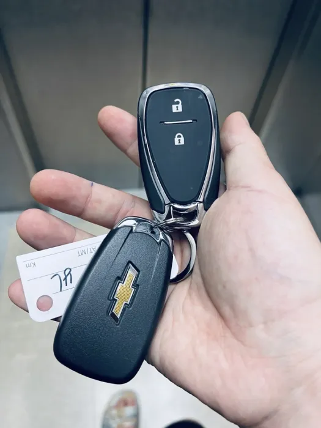

5천키로 밖에 타지 않은 22년 마지막 생산 더 뉴 스파크 프리미어 CVT 중고차를 구매했습니다. 풀 옵션이라 그런가 사이드미러에 후측방 충돌 방지 경고도 뜨고 핸들 가볍게 만들어주는 시티모드도 있고. 당시 만 22세 임에도 불구하고 단종되어 차량 댓수도 적으면서 신차라 사고도 적고 안전 장치들도 빠방하게 내장되어있어 보험료가 150만원 정도로 굉장히 합리적이었습니다. 부모님 밑으로 넣은게 아니라 제 명의 1인 가입임에도 불구하고 말이죠.

경차니까 하이패스, 공영주차장도 반값이고 연비는 적당히 나오고 괜찮지요.

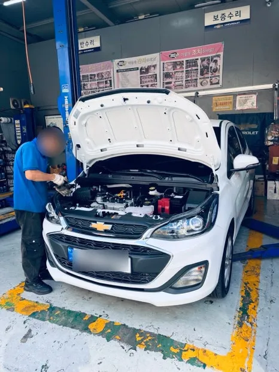

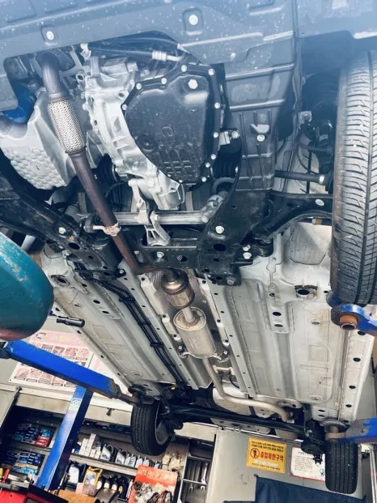

사자마자 청담 쉐보레 서비스센터에서 점검 받아봤는데 탄지 얼마 되지도 않은 새차라 그런지 설렁설렁 보시고 괜찮다고 그냥 타라고 하시더라구요. 상태가 너무 좋아보여서 그런건가 싶었습니다.

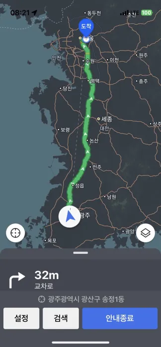

첫차 구매 기념으로 장거리를 뛰어봤는데 상당히 인상적이었습니다.

철판들이 두꺼워서 그런가 운전할때 모닝하고 비교하면 묵직함이 있었고 크루즈 컨트롤 덕에 악셀을 계속 안밟아도 손으로 속도를 조절하면서 편하게 갈 수 있으니 아주 좋았습니다.

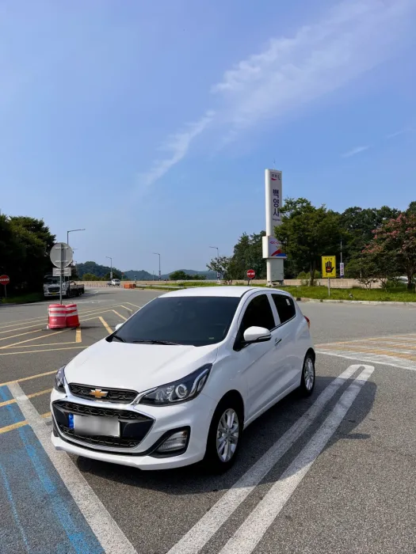

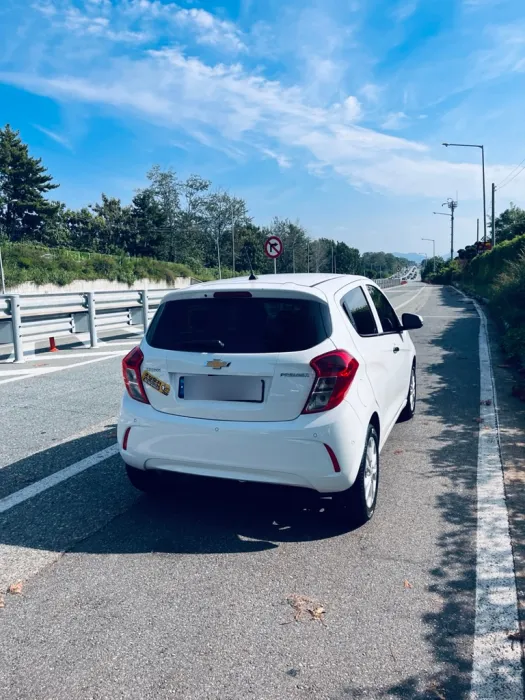

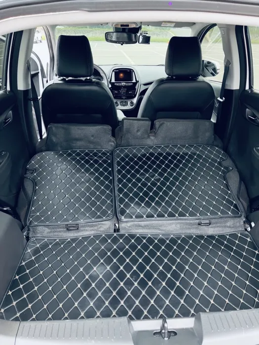

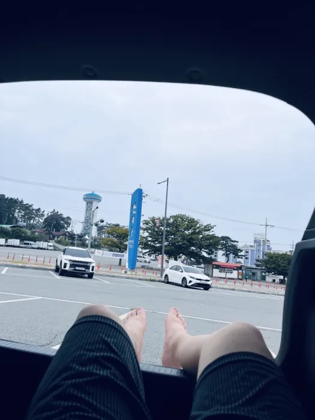

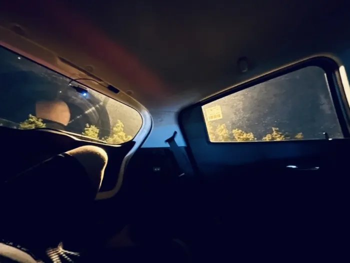

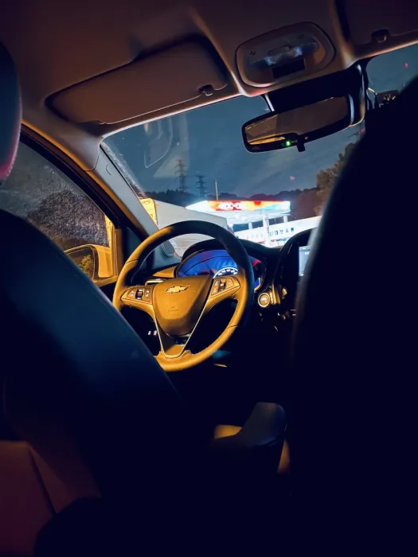

당시엔 운전 초보라 그런진 모르겠지만 밟으면 밟는대로 쭉쭉 나가주니 가속력에 있어서도 전혀 불편함과 아쉬움이 없었고 뒷좌석도 폴딩해서 누울 수 있었으니 대만족이었습니다.

하지만 운전이 너무 쉬워버리니 가슴 한켠에 허전함이 생기기 시작했습니다. 떠오르는 아버지의 한마디 "오토는 차가 아니다"

아하 수동차로 바꾸면 되겠구나!

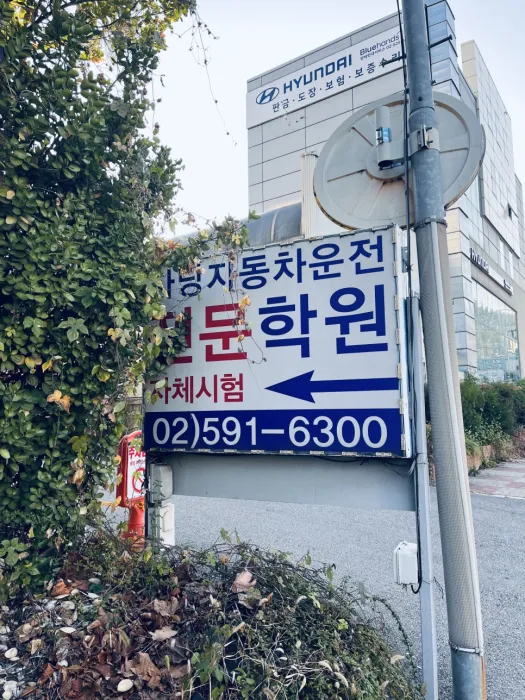

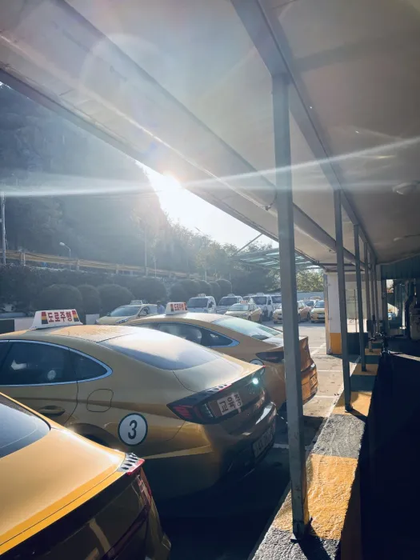

2종 자동 면허가 있으면 장내기능시험만 통과하면 2종 수동 면허를 취득할 수 있다고 해서 바로 학원으로 달려갔습니다.

학원에 2종 수동 면허 시험을 칠 수 있는 차량은 단 한대만이 존재. 요즘같이 오토로 다 넘어간 상황에 너 같이 유별나게 수동을 몰려고 하는 사람은 처음본다. 차라리 따도 1종 수동 면허를 따지 왜 2종 수동을 따려고 하는지 강사진에게 한쿠사리를 듣고 교육과 시험을 봤습니다.

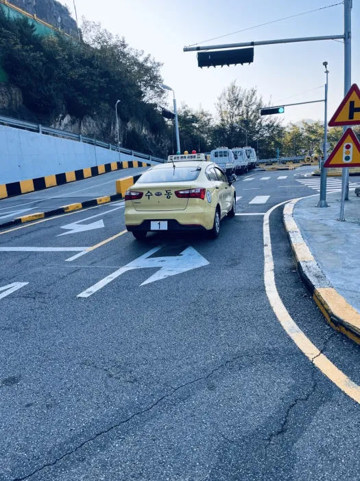

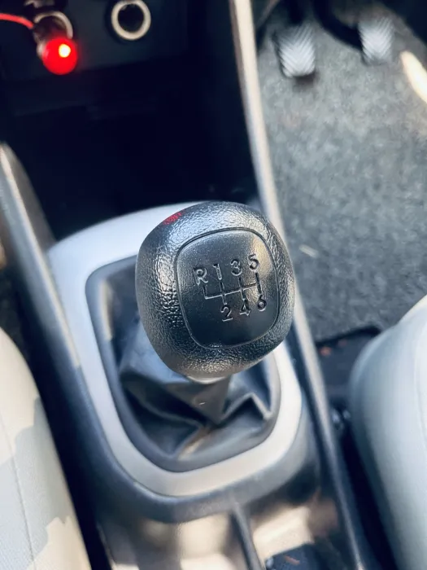

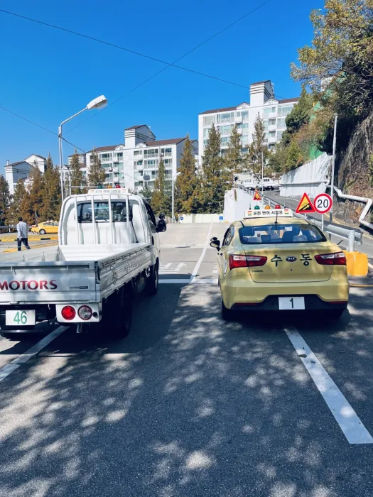

반클러치를 써야하는 언덕 탈출과 주차에서 시동을 꺼먹는 등 난항을 겪었지만 한방에 통과하고 수동 면허를 손에 쥐는데 성공했습니다. 자동 면허를 취득한지 2달 밖에 안지난 시점에 말입니다.

그런데 수동차가 매물이 잘 안보이고, 있어도 보험료가 높게 나와서 결국 기변은 포기하고 무사고 보험 이력을 착실히 쌓으면 미래의 내가 도전해주겠지란 생각에 우선 스파크를 계속 몰기로 했습니다.

.webp)

이중 삼중을 넘은 사중 주차 지옥 때문에 서울에서 빌라 월세 자취로 살거면 차는 절대 사면 안되겠구나 라는 것도 배웠습니다. 하하