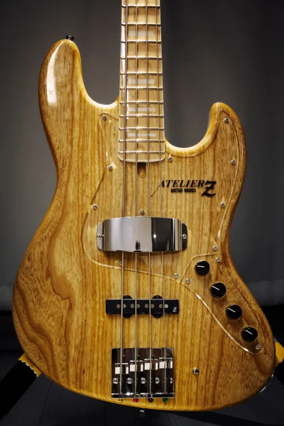

# AtelierZ M245 CTM

### 한 줄 평가

튼튼하고 예쁘고 무거운 슬랩 원툴 머신

### 스펙

| 무게 | 4.590kg |
| --- | --- |
| 바디 | Ash 2P |
| 넥 | Maple 1P 20F |
| 튜닝 페그 | GOTOH GB528 |
| 브릿지 | ATELIER Z BB419 |
| 픽업 | ATELIER Z JBZ-4 |
| 프리앰프 | BARTOLINI XTCT + MCT-375 |
| 제조년월 | 2025년 6월 |
| 구매 사이트 | https://shop.geekinbox.jp/?pid=188280357 |

### 연주감

 준수하다. 나쁘지도 좋지도 않은 이 느낌.

1. 페그가 매우 부드럽게 돌아가서 편하다.
2. 바디가 무거워서 넥다이브가 없어가지고 왼손이 편하다.
3. 1번 줄 더블 썸이나 더블 플럭시 볼륨 노브가 손바닥 끝부분에 닿아서 자꾸만 돌아간다.
4. 액티브 - 패시브 전환이 스위치로 되어있어 편하다.
5. 넥은 그리 두껍지도 얇지도 않은 적당한 두께이다.
6. 20프렛 모델이라 고음역대를 연주하려면 왼손이 많이 움직여야 한다.
7. 넥이 글로스 마감이라 왼손이 잘 미끄러진다.
8. 조인트 부분이 튀어나와있어서 그런지 손이 자꾸만 걸려서 15번 프렛 이후를 누르기가 어렵다.
9. 무거워서 다리에 올려두면 다리가 저리고, 어깨에 메면 어깨가 저리다.
10. 넥이 거의 스트레이트인 상태에서 현을 낮게 셋업해도 버징이 많이 나지 않는다.
11. 넥이 안휜다. 방 안에서 빨랫감도 말리고 창문도 막 열어놓는 등 온습도가 굉장히 들쭉날쭉한 상황인데도 안휜다.

### 외관

 QC 완벽하다. 네츄럴을 좋아하는 사람이라면 환장할 수 밖에 없는 디자인. 못생긴 두꺼운 기존 픽업가드를 탈거하고 베이스고수샵에서 얇은 픽업가드를 따로 구매해서 장착했다.

### 소리

 노이즈가 없다. 모든 노브를 12시로 맞춰뒀을때 V스쿱 톤이 나온다. 프론트 픽업은 되게 멍텅구리한데 저음이 빠진 허전한 프레시전 소리가 나고, 리어 픽업은 힘이 없는 스팅레이 소리가 난다. 핑거링은 항상 일관된 깔끔한 소리가 나서 재미가 없다. 이펙터를 잘 건다면 꽤나 쓸만하겠지만 초보인 나는 이펙터를 전혀 다룰 줄 모르기에 포기. 슬랩은 마커스 밀러 소리가 난다. 뽕이 차오른다.

### 결론

4현 재즈 베이스는 더 상위기종으로 갈 필요없이 이걸로 종결.
