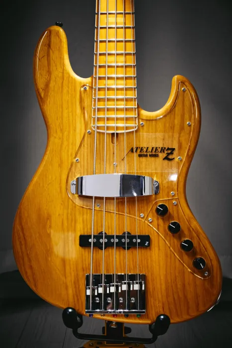

# AtelierZ M265

### 한 줄 평가

지판이 넓어서 슬랩이 편해서 좋으나 뮤트 난이도가 지옥인 슬랩 머신

### 스펙

| 무게 | 4.550kg |
| --- | --- |
| 바디 | Ash 2P |
| 넥 | Maple 1P 21F |
| 튜닝 페그 | GOTOH GB528 |
| 브릿지 | ATELIER Z BB519 |
| 픽업 | ATELIER Z JBZ-5 |
| 프리앰프 | BARTOLINI XTCT + Spectrum boost |
| 제조년월 | 2024년 7월 |
| 구매 사이트 | https://geekinbox.kr/product/%EC%A4%91%EA%B3%A0atelier-z-m26519p-vintage-natural-455kg-041672gib%EC%84%9C%EC%9A%B8/6418/category/26/display/1/ |

### 연주감

1. 아틀리에 치고는 가벼운 편에 속하나, 그래도 바디가 무겁게 느껴짐.
2. 현 간 간격이 4현과 동일한 19mm여서 슬랩이 편하나 5번 줄 뮤트 난이도가 지옥.
3. 넥이 되게 넓어서 엄지가 아래로 꽤 내려가지 않으면 5현에 닿지 않는다.
4. 넥이 매우 얇다. 휘는거 아닌가 걱정될 정도로 얇은데 정작 한번도 휜 적이 없다.
5. 바디가 무거워서 넥 다이브가 없다.
6. 5kg랑 비교하면 확실히 가벼운게 맞는데, 부담될 정도로 무겁다.
7. 무겁다 그냥 무겁다.

### 외관

 QC 완벽. 넥 포켓 도장 크랙도 없음. 넥은 사틴 마감이라 부들부들한게 쥐었을때 느낌이 참 좋다.

### 소리

 노이즈 없음. 플럭하면 땡땡거리는 소리가 난다. 5현 뭔가 펑퍼짐한게 맘에 안든다. MCT-375 같은게 안붙어있어서 미들을 건들수가 없다. V스쿱에서 벗어나기가 힘들다. 마커스 밀러 소리를 좋아한다면 저렴한 중고 하나 구해봐도 괜찮지 않을까 싶음. 500만원 주고 살 물건은 아닌 것 같기도...

### 결론

 5현 슬랩 많이 치나? 아틀리에는 4현이 정배가 아닐까? 초보라 잘 몰라서 그런건진 모르겠으나 M265는 되게 애매한 포지션인 것 같다. 사놓곤 10시간도 안치고 짱박아두다가 끝내 처분해버린 비운의 베이스.
