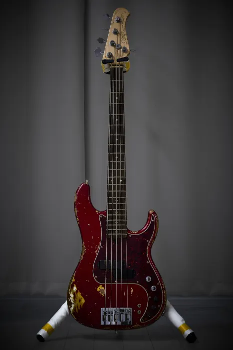

# Xotic XP-1T

## 한 줄 평가

펜더 커스텀샵보다 살짝 저렴한 가격에 살 수 있는 실패없는 안전빵 세션 머신.

## 스펙

| 항목 | 내용 |
| --- | --- |
| 무게 | 4.270kg |
| 바디 | Alder |
| 넥 | Maple / Rosewood 21F |
| 튜닝 페그 | HIPSHOT ULTRALITE |
| 브릿지 | XOTIC TYPE-A BRASS |
| 픽업 | XOTIC ORIGINAL |
| 프리앰프 | XOTIC PREAMP |
| 제조년월 | 2025년 1월 말 |
| 구매처 | https://shop.geekinbox.jp/?pid=189006602 |

## 연주감

굴곡이 가팔라서 AtelierZ와 비교했을때 조금 두껍게 느껴진다. 특히 M265랑 비교하면 체감 차이가 크다. 넥 두께는 Sadowsky >> Fender = Xotic > AtelierZ > Woofy Basses 순으로 두꺼운 것 같다. 개인적으로 아주 맘에 드는 두께다. 손에 착 감긴다는 말을 인생 처음으로 이해할 수 있었다.

넥이 오일 피니시인데다 헤비 에이지드 레릭 옵션이라 그런가 되게 거칠어서 엄지 손가락에 나무 가시 찔린 듯한 느낌이 연주 중에 들고, 연주를 멈추고 난 뒤에도 30분 정도 여운이 있다. 진짜 가시가 찔린건가 싶다.

무게는 5현인데 4.3키로로 가벼운 편에 속한다. AtelierZ랑 비교하면 무게 차이가 꽤나 나서 체감이 잘 되었다.

나무 픽업 커버 덕분에 빠른 핑거링 속주가 가능했다. 핑거램프를 따로 구매해서 부착하지 않아도 충분할 정도. 감촉도 좋아서 나중에 새로운 베이스를 구매할 일이 생긴다면 꼭 나무 픽업 커버를 개조를 해서라도 부착할 것 같다.

바디가 가벼워서 그런가 넥다이브가 조금 있는 것 같다.

피크질 되게 편하다.

## 외관

레릭된 부분에 오일 마감이 되어있는지 쉽게 더러워지지 않고, 까진 페인트 부분 근처에도 일련의 마감이 되어있는지 남은 페인트가 벗겨질려고 하지 않는다.

신품일수록 프렛보드 색이 연한데, 내꺼도 검은색이 아니라 살짝 어두운 갈색에 가까워서 사진 보정을 조금 해야했다. 살짝 연한게 더 멋진 것 같기도?

웨더체크 레릭이 진짜 예술에 가까울 정도로 잘 되어있다.

## 소리

해상도 높은 깔끔한 프레시전 소리가 난다. 너무 깔끔해서 재미가 없다. 펜더 프로페셔널 2 프레시전 베이스 쓸때 느꼈던 생각이 똑같이 들었는데, 아마 픽업이 빈티지가 아니라 XOTIC ORIGINAL 이어서 그런 것 같다.

합주하면 진짜 잘 묻힐 것 같은 소리가 난다. 프리앰프는 베이스 미들 트레블을 건들 수 있고, 미들과 트레블의 경우 대역대를 변경할 수 있는 스위치 두개가 있는데 헤드폰으로는 대역대의 변화에 의한 소리 차이를 잘 알아차리지 못하겠다.

나무 픽업 커버 덕분에 손가락이 닿아도 잡음이 없다. 픽업이 외부에 노출되질 않아서 산화도 잘 안되나 봄. 오래 쓸 수 있을 것 같다.

5현 로우 B가 심리 치료되는 수준이다. 둥.... 하고 깔아주는게 너무 좋다.

## 결론

올해 1월 신품을 저렴한 가격에 구매할 수 있었고, 조틱 프레시전 자체가 매물이 잘 없어서 구하기도 힘든걸 구할 수 있어서 행복하다. 심지어 색도 맘에 쏙 든다. 얘는 무덤까지 평생 들고 가야지. 프레시전은 이걸로 종결.
