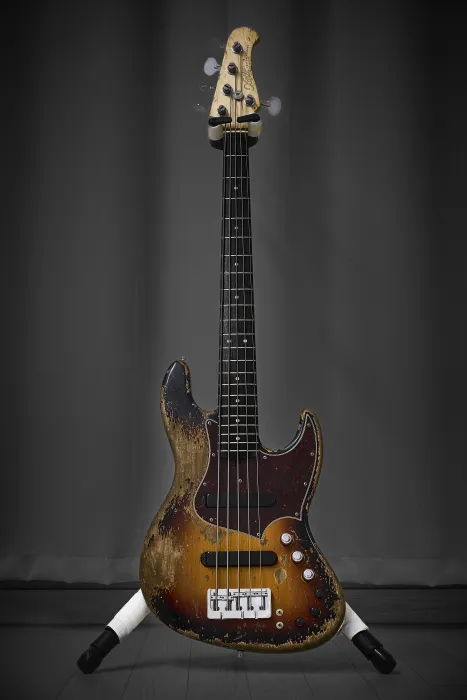

# Xotic XJ-1T

### 한 줄 평가

범용성 최강, 프로들을 위한 세션머신

### 스펙

| 무게 | 4.145kg |
| --- | --- |
| 바디 | Alder |
| 넥 | Aple / Rosewood 22F |
| 튜닝 페그 | HIPSHOT ULTRALITE (Lolly Pop) |
| 브릿지 | HIPSHOT B-STYLE |
| 픽업 | RAW VINTAGE |
| 프리앰프 | XOTIC PREAMP |
| 제조년월 | 2025년 10월 말 |
| 구매처 | https://shop.geekinbox.jp/?pid=189206635 |

### 연주감

[Xotic XP-1T](../xotic-xp-1t/)와 동일하다. 재즈, 프레시전 구분없이 같은 넥 규격을 사용하는 듯함

### 외관

 Super Heavy에 3 Tone burst 옵션이라 프로가 오랜시간 전투형으로 사용한 느낌이 물씬 느껴지는데, 움푹 파인 덴트 같은건 전혀 없고 페인트만 잘 까져있다. 잘 안보이지만, 매의 눈으로 보면 웨더체크도 보인다. XP-1T Heavy 레릭 옵션보다가 이거 보니까 역체감이 장난아니다. Super Heavy 옵션이 더 비싸다고 하던데 그럴만 한 것 같다.

 넥 뒷편도 손에 의해 자연스럽게 까진 것 같은 느낌으로 레릭광인 나에겐 아주 흡족스러운 디자인. 루민레이도 있어서 밤에 존재감 장난아니다.

### 소리

 톤 가변성이 장난아니다. 프레시전하고 크게 차이 안나는 넥 픽업, 완전 또랑또랑하고 명료한 브릿지 픽업. 노이즈는 아주 아주 미세하게 있는 것 같다. 빈티지 소리 제대로 난다. 푸시 풀 직렬 병렬 스위치 옵션도 있어서 편하다. 약간 키쿠치나 사도스키 같으면서도 펜더 같은 이 오묘한 그 무언가.. 원하는 소리가 무엇이든 만들어 낼 수 있다.

### 결론

 후쿠다 히로무의 팬으로써, 레릭 올드펜더를 사보려다가 무지막지하게 비싼 가격과, 심각한 매물들의 상태, 유지보수성에 좌절하고 포기하려던 찰나 한줄기 빛처럼 나타난 Xotic. 자주 애용하는 베이스샵에서도 매물이 씨가 말랐다. 간만에 샵에 베이스 셋업 받으러갔는데 대표님이 오더 넣은 Xotic 커스텀 베이스가 막 출고되었고 조만간 웹사이트에 올라올거다라고 말씀하셔서 예의주시하다 올라오자마자 구매한 베이스. 11월 세일 기간까지 겹쳐서 운좋게 저렴하게 살 수 있었다. 옵션들 보니까 비싼 이유를 알겠다. 막귀에 초짜인 내가 살짝 쳐봐도 환상적인 소리가 난다.

 평생 무덤까지 들고가지 않을까 싶은 베이스. 앞으로 한 몇 년간은 이 친구랑 즐겁게 놀아야겠다.
