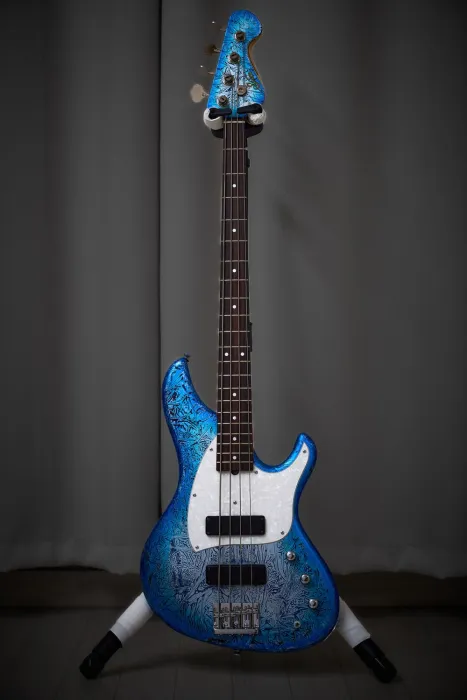

# Sago Stem Ove 4

## 한 줄 평가

동양인 체형 안성맞춤 예쁜 베이스.

## 스펙

| 항목 | 내용 |
| --- | --- |
| 무게 | 3.?kg |
| 바디 | Alder 2P |
| 넥 | Hard Maple / Rosewood 21F |
| 스케일 | 864mm |
| 넥 쉐입 | Slim C |
| 지판 반경 | 9.5" |
| 튜닝 페그 | Gotoh GB528 |
| 브릿지 | Gotoh 201B-4 |
| 너트 | Oiled Bone |
| 픽업 | L(x) JB-Lite1 (Alnico5) |
| 프리앰프 | 없음(패시브) |
| 컨트롤 | Master Volume / Balancer / Master Tone / Hum Switch |
| 제조년월 | 2025년 11월 말 |
| 구매처 | 긱인박스 서울지점(오프라인) |

## 연주감

바디가 일반적인 재즈 베이스보다 슬림하게 설계되어 있어서 상당히 가볍다. 헤드도 작고 튜닝 페그도 경량 모델(Gotoh GB528)이라 전체적인 무게 밸런스가 좋고 넥다이브가 없다.

넥은 슬림한 C 쉐입이다. 일반적인 재즈 베이스와 비슷한 두께로, 손이 작아도 편하게 잡힌다.

나무 픽업 커버가 일반 플라스틱 커버보다 넓어서 엄지 거치대 역할을 한다. 핑거링 시 엄지를 올려놓기 편하다.

## 외관

사고 시그니처 색상인 Glacier wrap-naked. Wrap Naked 마감은 일반 Wrap 마감과 달리 표면의 울퉁불퉁한 텍스처를 그대로 살린 반무광 처리다. 광택 마감처럼 패턴이 선명하게 드러나지 않는 대신 차분하고 독특한 질감이 특징이다.

사이드 포지션 마커에 Luminlay 축광 소재를 사용한다. 빛을 흡수한 뒤 어두운 무대에서 은은하게 빛난다.

## 소리

L(x) JB-Lite1 픽업은 Alnico5 자석 기반이다. Sago 공방의 레시피로 설계된 픽업으로, 발음이 좋고 핑거링에서도 묻히지 않는 중심감 있는 소리가 난다. 슬랩이나 피크 연주에서는 싱글코일 특유의 캐릭터가 잘 드러나고, 앙상블에서 저음으로 받쳐주는 힘도 충분하다.

험 스위치로 직렬/병렬 전환이 가능하다. 직렬로 전환하면 로우미드가 두꺼워지면서 볼륨이 올라가고, 병렬에서는 리듬 연주에 적합한 톤이 된다.

브릿지가 무게감 있는 Gotoh 201B-4라서 패시브임에도 서스테인이 길다. 액티브 모델인 Sago Ove에 근접하는 서스테인이라고 한다.

## 결론

난 예뻐서 샀다. 보자마자 첫 눈에 반했음. 이 악기를 들고 무대 위에 선 모습을 상상하니 쾌감이 몰려왔었다. 마침 4현 줄도 잔뜩 사놓은게 있어서 4현 베이스를 사고 싶기도 했었음. 갖고 있는 4현 베이스가 한대도 없었걸랑. 

바디가 작아서 그런건지 하드웨어가 가벼워서 그런건지 무게감이 거의 느껴지지 않는다. 베이스우드 급은 아니지만 엄청 가벼웠다. 개인적으론 무게가 느껴지지 않을 정도.

막 다루면서 연습하기 좋은 4현 베이스 같음.

플럭할때 손가락이 깊게 들어간다는 점이 유일한 단점 같달까.. 픽가드 높이가 너무 낮음. 바디 두께가 얇은 것 같기도 함. 얇다고 서스테인이 짧다던가 울림이 작다던가 그런건 일절 없음. 연주감이 어색할 뿐.