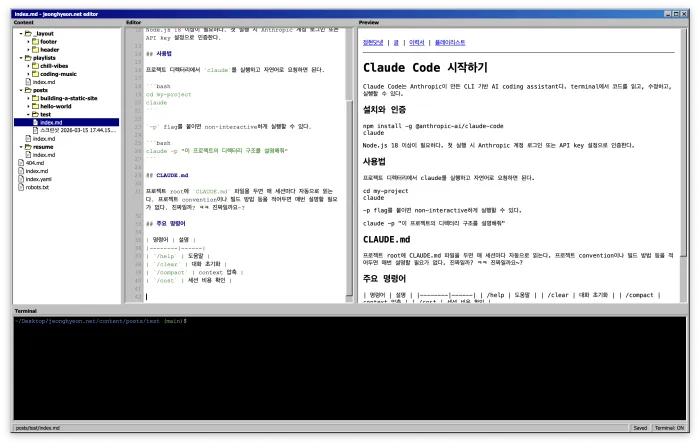

# Claude Code 시작하기

Claude Code는 Anthropic이 만든 CLI 기반 AI coding assistant다. terminal에서 코드를 읽고, 수정하고, 실행할 수 있다.

## 설치와 인증

```bash
npm install -g @anthropic-ai/claude-code
claude
```

Node.js 18 이상이 필요하다. 첫 실행 시 Anthropic 계정 로그인 또는 API key 설정으로 인증한다.

## 사용법

프로젝트 디렉터리에서 `claude`를 실행하고 자연어로 요청하면 된다.

```bash
cd my-project
claude
```

`-p` flag를 붙이면 non-interactive하게 실행할 수 있다.

```bash
claude -p "이 프로젝트의 디렉터리 구조를 설명해줘"
```

## CLAUDE.md

프로젝트 root에 `CLAUDE.md` 파일을 두면 매 세션마다 자동으로 읽는다. 프로젝트 convention이나 빌드 방법 등을 적어두면 매번 설명할 필요가 없다. 진짜일까? ㅋㅋ 진짜일까요~?

## 주요 명령어

| 명령어 | 설명 |
|--------|------|
| `/help` | 도움말 |
| `/clear` | 대화 초기화 |
| `/compact` | context 압축 |
| `/cost` | 세션 비용 확인 |


